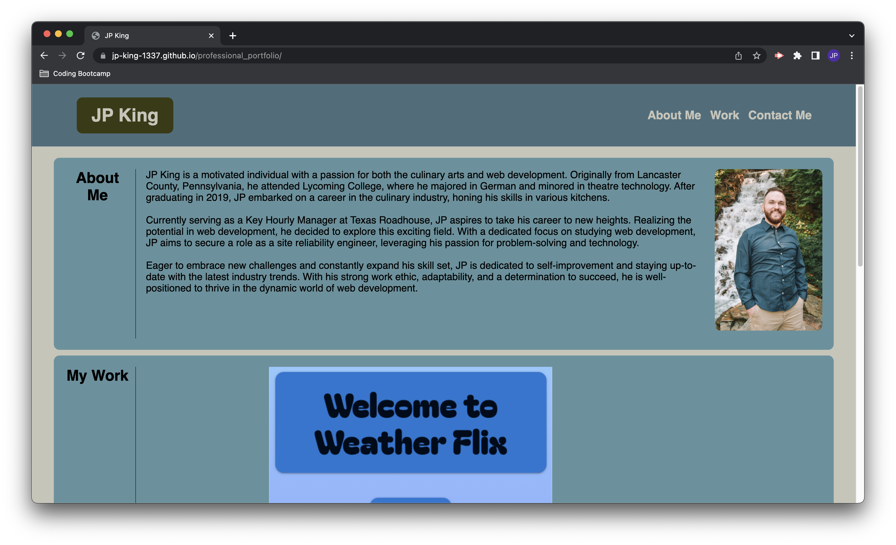
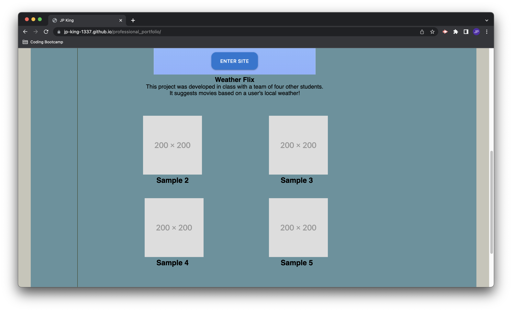
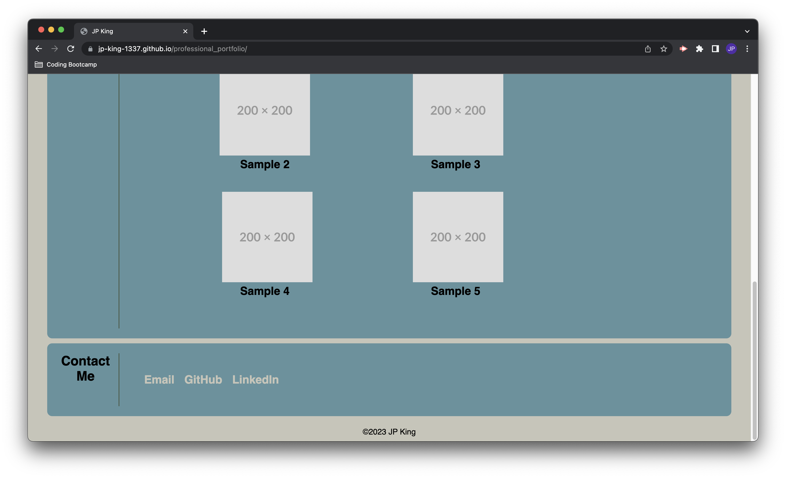

# professional_portfolio

## Description

This is my first portfolio website, made from scratch and updated to include the first project I've worked on with a group in class.

## Table of Contents

- [Installation](#installation)
- [Usage](#usage)
- [Credits](#credits)
- [License](#license)

## Installation

Use SSH to clone the project from github, with this:
git clone git@github.com:jp-king-1337/professional_portfolio.git

## Usage

This is my portfolio website, originally created to be graded as part of my participation in the Rutgers Coding Bootcamp. Now, it serves as a place to show off the work I've done in the class and will be updated to reflect the work I do in the future.

[Deployed Link](https://jp-king-1337.github.io/professional_portfolio/)

## Credits

I previously asked questions of ChatGPT when building this site almost a month ago. For the changes I made tonight, I needed no assistance.

## License

MIT License

Copyright (c) 2023 JP

Permission is hereby granted, free of charge, to any person obtaining a copy
of this software and associated documentation files (the "Software"), to deal
in the Software without restriction, including without limitation the rights
to use, copy, modify, merge, publish, distribute, sublicense, and/or sell
copies of the Software, and to permit persons to whom the Software is
furnished to do so, subject to the following conditions:

The above copyright notice and this permission notice shall be included in all
copies or substantial portions of the Software.

THE SOFTWARE IS PROVIDED "AS IS", WITHOUT WARRANTY OF ANY KIND, EXPRESS OR
IMPLIED, INCLUDING BUT NOT LIMITED TO THE WARRANTIES OF MERCHANTABILITY,
FITNESS FOR A PARTICULAR PURPOSE AND NONINFRINGEMENT. IN NO EVENT SHALL THE
AUTHORS OR COPYRIGHT HOLDERS BE LIABLE FOR ANY CLAIM, DAMAGES OR OTHER
LIABILITY, WHETHER IN AN ACTION OF CONTRACT, TORT OR OTHERWISE, ARISING FROM,
OUT OF OR IN CONNECTION WITH THE SOFTWARE OR THE USE OR OTHER DEALINGS IN THE
SOFTWARE.

## Badges

N/A

## Features

N/A

## How to Contribute

N/A

## Tests

N/A